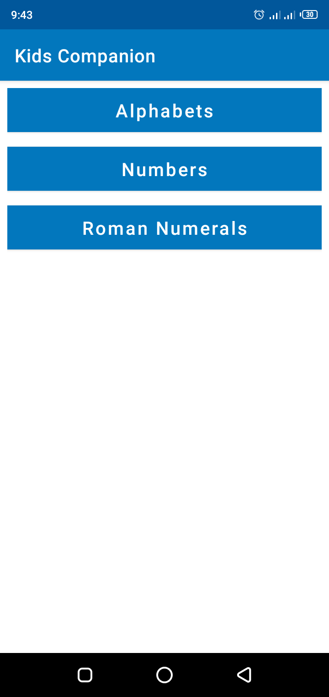
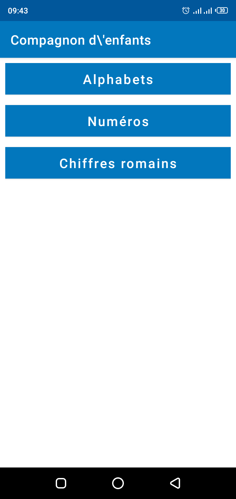
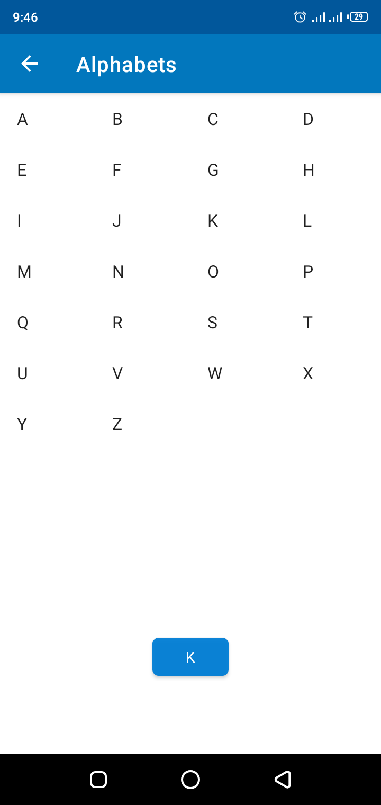
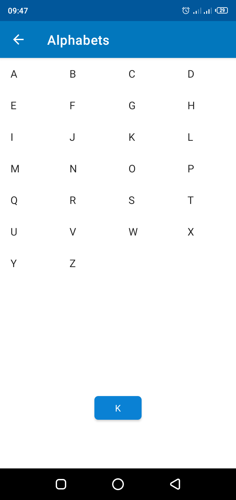
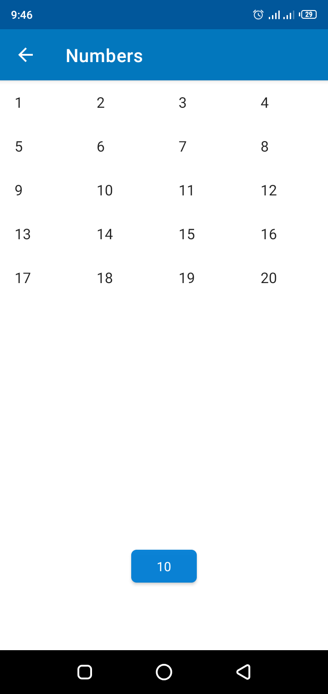
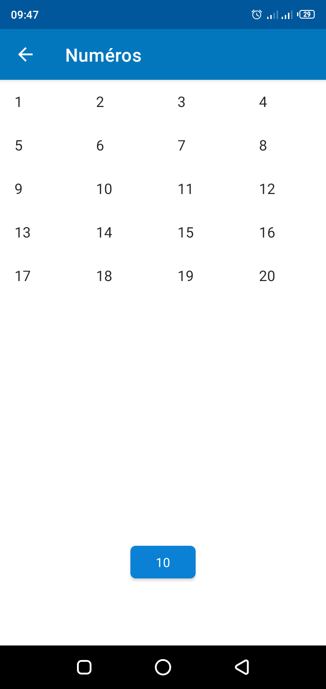
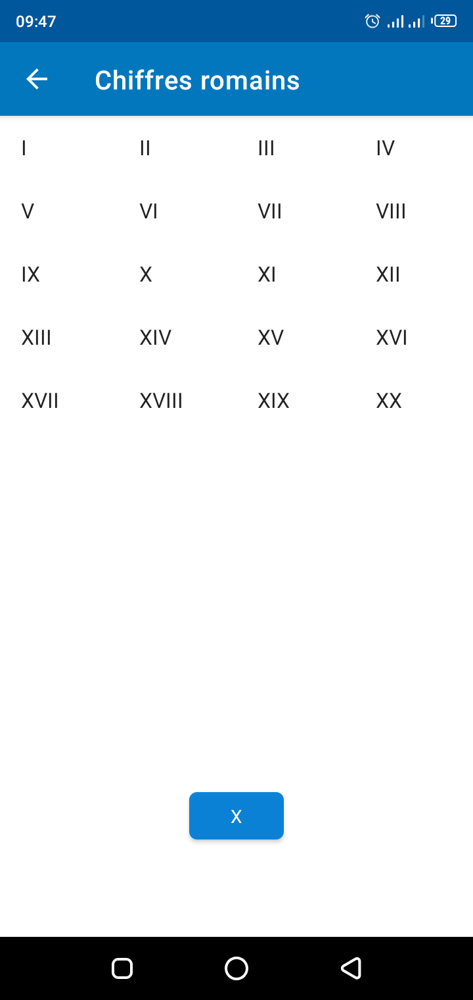

# Kids-Companion

## About
A simple App that helps children learn the basics of Alphabets, Numbers and Roman Numerals. A toast message is displayed when an item on the GridView is clicked

## Features
* Using GridView for populating List items
* Performing an action in response to a touch event
* Navigating using Intents
* Creating support for different languages for easy accessibility

## App Demo

 |Home Screen (English)|Home Screen (French)|
 |:-:|:-:|
 |||
 
 |Alphabets (English)|Alphabets (French)|
 |:-:|:-:|
 |||
 
 |Numbers (English)|Numbers (French)|
 |:-:|:-:|
 |||
 
 |Roman Numerals (English)|Roman Numerals (French)|
 |:-:|:-:|
 |||
             
             
             
